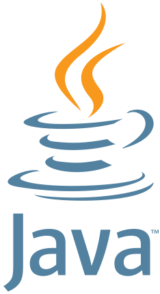
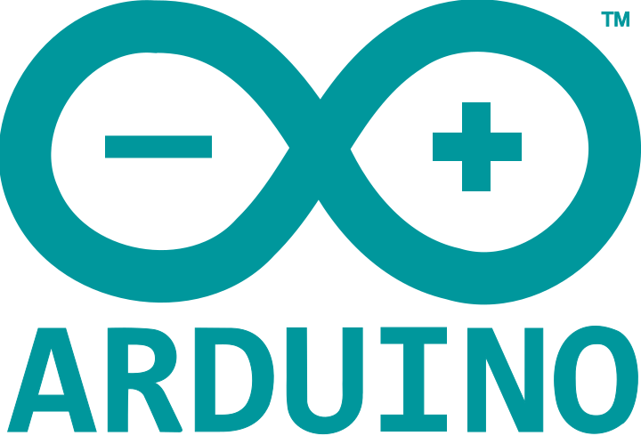
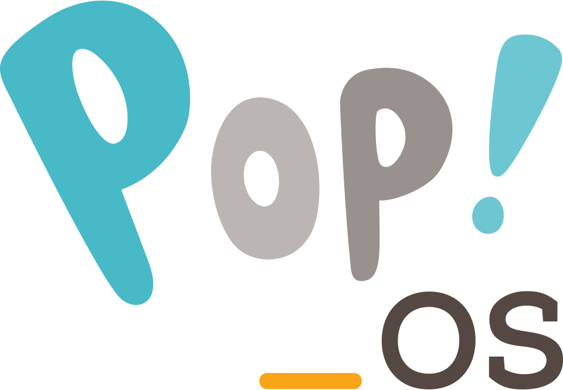

## 📊 My Statistics

---

## 🛠 Programing languages and tools

 
   
   
   
   
   
   

---

## 🖥️ Linux

   
   

---

## 🌟 Some other projects
- 🎮 [Scratch game](https://scratch.mit.edu/projects/1144569747/)
- 🧪 [Simulador de plano inclinado](https://playcanv.as/p/RQ0Eu8gG/)
- 🔐 [Projeto de codificação de texto (Alura One)](https://chalenge-decodificador.vercel.app/)
